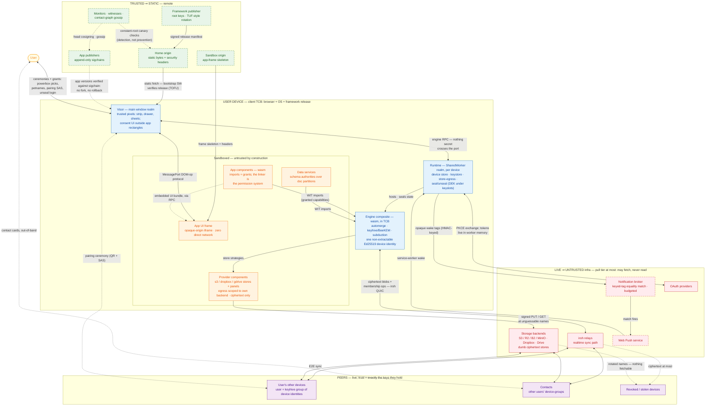

# polyvisor

A framework for building PWAs that inverts the standard web application
architecture: applications run client-side, as WebAssembly
component-model components, under user-controlled capability
confinement — a permissions model in the spirit of modern mobile OSes,
but cross-platform because the "OS" is a set of browser primitives the
framework composes.

**Status: nothing here is finally decided; the entire framework is
unstable until declared otherwise.** [NOTES.md](NOTES.md) is the living
design record and the authority behind everything on this page; open
questions live in the issue tracker.

## Trust model

The organizing invariant:

> **Nothing in the system is both live and trusted.**
> Trusted ⇒ static (the home origin's content, release artifacts).
> Live ⇒ untrusted by construction (relays, push services, storage
> backends, peers), covered by end-to-end crypto and capability
> confinement.

## Actors, realms, and trust domains

**Solid borders are built** — in-tree and gated (the engine's native
batteries, the device-store matrix, the demo e2e suite). **Dashed
borders are planned** — designed in NOTES.md, no code yet: the entire
release-integrity story
([#3](https://github.com/polymorph-components/polyvisor/issues/3) —
publisher keys, signed manifests, the verifying bootstrap service
worker; the demo today is served as plain static files with none of
it), app-publisher sigchains and witnessing
([#52](https://github.com/polymorph-components/polyvisor/issues/52)),
the dedicated sandbox origin (an open decision — frames today are
opaque-origin `srcdoc`), and the notification broker + Web Push wake
path. Solid does not mean finished, either: the permission machinery
behind "imports = grants" exists as fragments (host-scoped fetch
imports, the egress-grant factories) while the general grant table and
consent surface are still design, and exactly one data service exists
(`polyvisor:tasks`).

Reading the diagram:

- **Realms on the device.** The visor owns the main window (trusted
  pixels: the strip, drawer, and sheets where every consequential act
  happens). App UI lives in an opaque-origin sandboxed iframe with zero
  direct network — all state and assets arrive over RPC. The runtime is
  a SharedWorker per device hosting the engine composite; wasm guest
  realms inside it split into the in-TCB engine and the confined
  apps/services/providers.
- **The linker is the permission system.** A component's authority is
  its import set: deny = unlinked or stubbed, prompt = the async import
  suspends on consent, revoke = a defined error, never a trap. Grants
  flow through the powerbox pattern — picking the thing *is* the grant.
- **Remote access tiers** use keyhive's vocabulary: *pull / read /
  mutate / manage*. Infra (relays, storage, broker) sits at pull — it
  may fetch ciphertext, never read it. Contacts sit at read and above,
  exactly as granted: read = BeeKEM epoch keys, pull = name-keys,
  write = signed operations validated at merge time.
- **The consent surface is the deliberate exception.** Mechanically it
  is the most confinable component in the system, but it holds *kernel
  capabilities* (grant-table write, trusted surface), granted only via
  the signed-release appointment path, never via the powerbox — TCB
  membership, not blast radius.
- **Static trust is detection-shaped.** The web platform has no pinning
  primitive; the bootstrap service worker verifies releases after a
  TOFU first visit, and monitors, witnesses, and contact-graph gossip
  make targeted substitution, rollback, and freezes detectable rather
  than impossible.
- **Headless compute** (the same engine at an always-on node or
  provider) is a conscious powerbox decision: that host holds keys for
  whatever it is granted, moving it from "infra" to "peer" in this
  picture.

## Repository layout

| Path | Contents |
| --- | --- |
| [NOTES.md](NOTES.md) | The living design record — authoritative |
| [engine/](engine/) | The engine composite: guest crates, fetcher component, native host harness |
| [runtime/](runtime/) | Embedding runtime: engine adapter, device store, keystore, pairing engine, storage egress |
| [visor/](visor/) | The visor: curated-DOM surface, frame isolation, system UI |
| [providers/](providers/) | Storage provider strategies and config panels (common, s3, dropbox, gdrive) |
| [wit/](wit/) | Framework-owned WIT contracts (surface, panel, tasks, fetch, blobstore draft) |
| [demo/](demo/) | The reference browser embedding and its e2e suite |
| [examples/](examples/) | Example app guests (todomvc) |
| [spikes/](spikes/) | Pure archive of executed validation spikes |
| [docs/](docs/) | GitHub Pages build |

## The substrate

The polymorph family de-risks the bottom of the stack:

- [polyengine](https://github.com/polymorph-components/polyengine) —
  components runtime-linked on stock browsers and Deno
- [component-iroh](https://github.com/polymorph-components/polymorph-iroh)
  — browser peers speaking end-to-end QUIC, one Ed25519 identity across
  all paths
- [polymorph:webcrypto](https://github.com/polymorph-components/polymorph-webcrypto)
  — identity keys as non-extractable platform handles behind
  capability-shaped WIT
- [polymorph:tls](https://github.com/polymorph-components/polymorph-tls)
  — in-guest crypto under a wasm timing-class policy
- [polymorph:test](https://github.com/polymorph-components/polymorph-test)
  — cross-implementation conformance machinery

The framework layer — the visor, the linker-as-permission-system, the
data services, and the consent UX — is what this repository builds.
